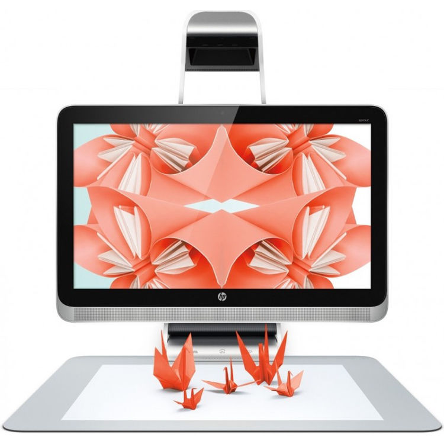
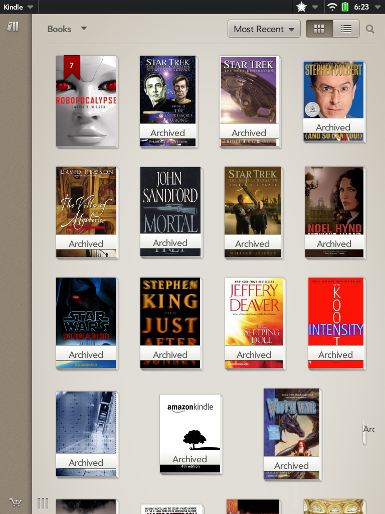

# Innovative Products Shipped
---
## Projection Computing & Machine Learning

### HP Sprout - Blended Reality PC (2014)

Sprout by HP empowers you to manipulate the physical and digital worlds in innovative ways. 

Built with a PC, projector, hi-res cameras, Touch Mat and 2D and 3D capture capabilities for an unbelievable experience.

Ability to capture, scan and detect objects using complex computer vision & machine learning algorithms

[News - Fast Company: HP’s Sprout Is A Bold Attempt to Reimagine The Desktop PC](https://www.fastcompany.com/3037699/hps-sprout-is-a-bold-attempt-to-reimagine-the-desktop-pc)

---
## Mobile Computing

### Amazon Kindle app for HP Touchpad tablet (Palm WebOS) (2011)

Spearheaded, Designed & Developed the Amazon Kindle app for HP Touchpad tablet (Palm WebOS) as a joint

collaboration with HP & Amazon. The Amazon's free "Buy Once, Read Everywhere" Kindle app that lets users read and sync 

over 810,000 of the most popular books was available on the new HP TouchPad (2011).

Whispersync technology syncs reader's place across devices, so they can pick up where left off.

[News - ZDNet: HP TouchPad: Kindle app review](https://www.zdnet.com/article/hp-touchpad-kindle-app-review/)

